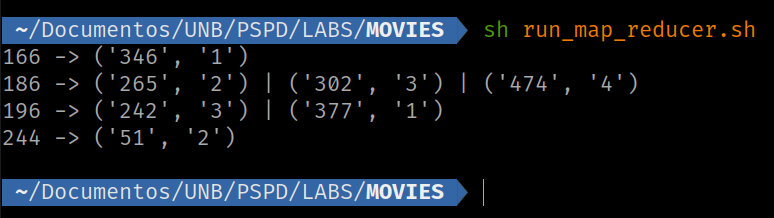
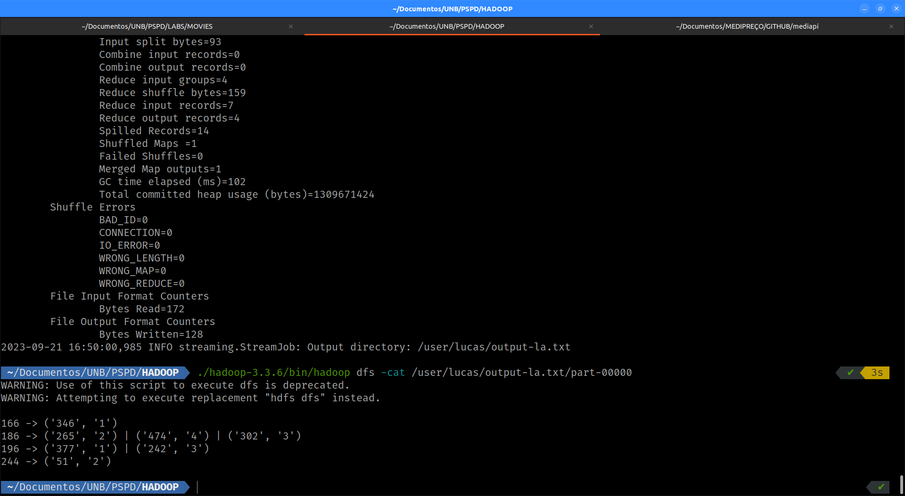

# PSPD

| Aluno | Matrícula |
| :-- | :--: |
| Lucas Gabriel Bezerra | 180125770 |
| Lucas Ursulino Boaventura | 180114093 |

## LAB. Map Reduce

Nesse laboratório foi colocado em prática os aprendizados sobre o uso do padigma Map Reduce no framework do Hadoop.

## Atividade 1

Para esse exercício, era necessário a listagem de notas para filmes de cada usuário seguindo o arquivo **movies_rating/movies.txt**.

- Na primeira etapa foi feito o código **movies_rating/normal.py** sem o uso do map reduce, com o código rodando através do comando:

```sh
 python normal.py
```

- Na segunda etapa foi feito o código **movies_rating/mapper.py** e **movies_rating/reducer.py**, com o código rodando através do comando:

```sh
# cat movies.txt | python3 mapper.py | sort -k 1,1 | python3 reducer.py
cd movies_rating/ && sh run_map_reduce.sh
```

As mudanças feitas no código, foi primeiro, a quebra da etapa de mapeamento (_mapper.py_) dos dados advindos do input do processo (_movies.txt_). E também a criação da etapa de consolidação dos dados ordenados (_reducer.py_) que foram output do processo de mapeamento.

E para respeitar esse processo foi feito a leitura através do stream de input dos processos com o auxílio do seguinte código:

```python3
"""mapper.py"""
mapper_input = sys.stdin.readlines()

# Despreza a primeira linha de cabeçalho do arquivo
for linha in mapper_input[1::]:
    linha = linha.strip()
    ...

    # Ao final o conteúdo de output do map é a seguinte string montada
    # > "6783 \t 76 \t 4 \t 7833427\n"
    print(f'{self.user_id}\t{self.movie_id}\t{self.rating}\t{self.ts}')
```

O resultado do comando utilizando o script é o seguinte:

```sh
# É necessário ajustar o caminho para os arquivos e o .jar

./hadoop-3.3.6/bin/hadoop jar hadoop-streaming-3.3.6.jar -input /user/lucas/movies.txt -output /user/lucas/output-la.txt -mapper ../LABS/MOVIES/mapper.py -reducer ../LABS/MOVIES/reducer.py
```


- Na terceira etapa, foi colocado o código a prova com o auxílio do framework do hadoop, conforme o comando e o print:



## Atividade 2

A Atividade 2 /pageRank implementa um page rank com um Grafo simples para simular, o que seria o rankeamento de páginas na web.

O PageRank é um algoritmo utilizado por motores de busca para ordenar e classificar páginas da web nos resultados das pesquisas. O objetivo do PageRank é avaliar a importância e relevância das páginas da web com base na estrutura da World Wide Web.

A World Wide Web é representada como um grafo, onde as páginas da web são os nós e os hiperlinks que conectam essas páginas são as arestas direcionadas. Nesse grafo, cada página da web é tratada como um nó, e cada hiperlink que leva de uma página para outra é considerado uma aresta direcionada.

Inicialmente, todas as páginas da web recebem um valor de PageRank igual. Isso significa que, no início, cada página tem a mesma importância relativa.

O algoritmo do PageRank adota uma abordagem interessante, imaginando um "navegador aleatório". Esse navegador começa em uma página da web aleatória e, a partir dela, segue os hiperlinks nas páginas que visita. Em cada página que o navegador alcança, ele enfrenta uma decisão: ele pode optar por seguir um dos links de saída da página atual ou, alternativamente, pode optar por pular para uma página completamente aleatória, com uma probabilidade determinada. Essa probabilidade é conhecida como fator de amortecimento, e ela representa a chance de o navegador seguir um link em vez de pular aleatoriamente para outra página.

Os valores de PageRank são recalculados de maneira iterativa. A cada iteração, o PageRank de cada página é atualizado com base no PageRank das páginas que estão vinculadas a ela. Isso significa que páginas que são ligadas por páginas de maior importância recebem pontuações de PageRank mais altas.

O processo iterativo continua até que os valores de PageRank alcancem um estado estável, ou seja, até que as mudanças nas pontuações de PageRank entre as iterações se tornem insignificantes.

Por fim, os valores de PageRank resultantes são utilizados para classificar as páginas da web nos resultados de pesquisa. Páginas com pontuações de PageRank mais elevadas são consideradas mais importantes e relevantes, influenciando a sua posição nos resultados de busca.


- Como rodar (Etapa 1)
```
pip install -r page_rank/requirements.txt
python pageRank.py
```